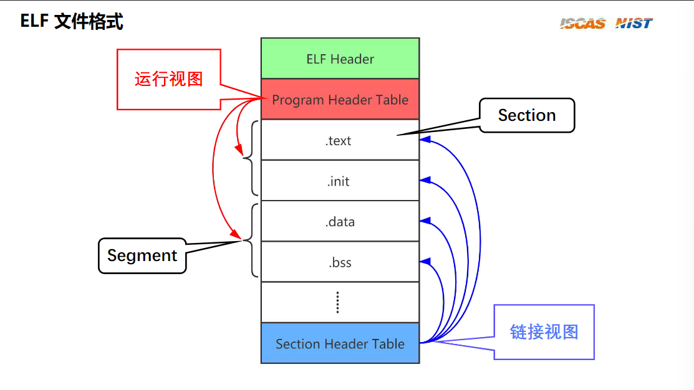
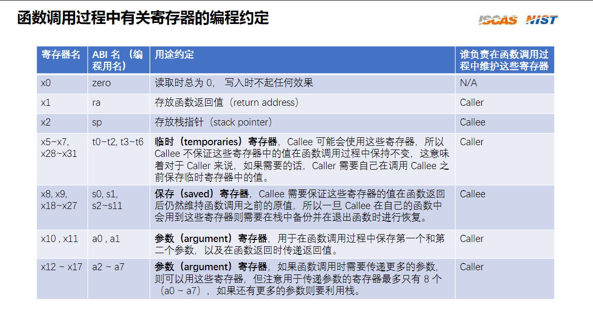

# LearningRecord

***

这是我参加2024春夏季开源操作系统训练营的学习文档

## Toc

***

***四月***
* [Day   1    (2024-04-12)](#0)  
* [Day   2    (2024-04-13)](#1)  
* [Day   3    (2024-04-14)](#2)  
* [Day   4    (2024-04-15)](#3)  
* [Day   5    (2024-04-16)](#4)  
* [Day   6    (2024-04-17)](#5)  
* [Day   7    (2024-04-18)](#6)  
* [Day   8    (2024-04-19)](#7)   

<span id="0"></span>
## Day 1


### 计划

***

1. 阅读《Rust语言圣经》和《Rust程序设计语言》巩固所有权和生命周期的概念  
2. 写rustlings  
3. 用Rust写leetcode  

### 成果 

***

1. 完成了对知识点的巩固，Rust在内存回收的机制上比C/C++（手动管理）更暴力--出作用域不管是在栈上还是在堆上的内存一律回收，比Java（GC）更高效--得益于Rust的查机制，内存回收策略更简单（暴力）  
2. 除了剩余的10道algorithm，其余部分全部完成  
3. 还没开始刷，发现迭代器和闭包学得不够扎实，还是不太熟悉Rust这门语言

### 待解决的问题

***

### 感想与总结

***

<span id="1"></span>
## Day 2


### 计划

***

1. 跟进《RISC-V上的操作系统 - 汪辰 - 2021春》，做lab  
2. 阅读《Rust编程之道》第三章类型系统  
3. 写rustlings

### 成果

***

1.  RISC-V调试指令  
```shell
#一律都要做的
cd ~/asm/<practice>
make
#查看指令的十六进制形式
make hex
#反汇编
make code
#退出反汇编
q
#运行代码
make debug
#退出gdb
Ctrl-C
quit
y
#单步调试（single instruction）
si
#重复上一次的命令
直接回车
```  
2. 阅读笔记  
- 字符串类型：  
    &str 由两部分组成：指针和长度信息，存储于栈上
    str字符串序列存储于堆上
    包含了动态大小类型地址信息和携带了长度信息的指针，叫作胖指针（Fat Pointer），所以&str是一种胖指针  
    这里我不是很理解的一句话是“对于编译器来说，str类型的大小是无法确定的”，但是后来我解决了，具体参考[这篇文章](https://zhuanlan.zhihu.com/p/597405802)，简单来就是要分清楚类型大小和值大小的区别。比如说：

```cpp
char a = 1;//那么此时a的类型大小是一字节，但是值大小是1
```  

同样的，对于str来说：  

```rust
let other: &str = "other_hello";//你不能脱离"other_hello"去谈str的类型大小
```  
再举个例子加深印象，假设有人问你u32的大小，你可以很确定地说是四字节，但是有人问你str的大小时，你是答不上来的，对于编译器也是如此，这取决于字符串序列的大小  

- 整数类型：
    - 在用Rust编程的时候，应尽量显式声明类型，这样可以避免一些麻烦
- 孤儿规则（Orphan Rule）
    - 孤儿规则规定，如果要实现某个trait，那么该trait和要实现该trait的那个类型至少有一个要在当前crate中定义。在代码清单3-28中，Add trait和u32、u64都不是在当前crate中定义的，而是定义于标准库中的。如果没有孤儿规则的限制，标准库中u32类型的加法行为就会被破坏性地改写，导致所有使用u32类型的crate可能产生难以预料的Bug。  

```rust
代码清单3-28：尝试重载整数的加法操作
use std::ops::Add;
impl Add<u64> for u32 {
    type Output = u64;
    fn add(self， other: u64) -> Self::Output {
        (self as u64) + other
    }
}
fn main() {
    let a = 1u32;
    let b = 2u64;
    assert_eq!(a + b， 3);
}
```  
3. 今天没写rustlings，《Rust编程之道》坏（我）我（太）好（菜）事（了）  

### 待解决的问题  

***

1. trait对象和动态分发不是很理解，by the way，《Rust编程之道》这本书的编排方很劝退，按顺序读下去是个错误，起码不是我现在能读得下去的书，太浪费时间了，还是乖去看《Rust程序设计语言》罢（悲）  
2. 我的markdown编辑习惯太差了，要重新学一下了。。。  

### 感想与总结

***

1. Rust基本过了一遍了，明天开始二刷《Rust程序设计语言》  
2. RISC-V的学习优先级要提高，之前学过Mips，这个也该不会太难  

<span id="2"></span>
## Day 3


### 计划

***  

1. 写数据结构课设的开题报告    

### 成果 

***

1. nothing~

### 待解决的问题

***

### 感想与总结

***  

<span id="3"></span>
## Day 4


### 计划  

***  

1. 跟进《RISC-V上的操作系统 - 汪辰 - 2021春》，做lab  
2. 阅读《The Rust Programming Language》  

### 成果  

***

1. 学了一些RISC-V指令  
2. 阅读笔记  
第10.3章

    - 对于生命周期和所有权的一些思考：  

        先来看一段代码：  

```rust  
fn max_of_refs(a: &i32， b: &i32) -> &i32 {
    if *a > *b {
        a
    } else {
        b
    }
}
```  

如果你稍微有学过点Rust，就知道上面这段代码是有问题的--“你应该指明生命周期！”  

但为什么要指明生命周期呢--”这样就可以确定返回的引用的生命周期了，有助于借用检测器在编译时进行检查“  

我一直不理解的是Rust为什么这么”蠢“，这个函数返回哪个引用你就拥有返回引用的生命周期不就行了吗？  

我不理解的点就出现在这，我对Rust提出了自己的期望：我希望引用的有效性是在**运行时**检查的  

确实，在许多其他编程语言中，引用的有效性可能是在运行时检查的，因此可能会发生悬垂引用等问题。  
但是，但是Rust要求十分严格，要求在**编译时**就能直接确定每个值和引用的生命周期。  
Rust 的设计目标之一是在编译时提供尽可能多的保障，以减少运行时错误的发生。  

在了解了这一点后，再来看上面这段代码，你就会开始理解Rust为了达成这一设计理念而做出的努力，假设上面这段代码能通过编译，那么**返回的引用的生命周期就无法在编译时期确定下来**，而Rust不喜欢不确定的东西！因此会拒绝编译这段代码。  

而一旦我们为其指定了生命周期：  

```rust  
fn max_of_refs<'a>(a: &'a i32， b: &'a i32) -> &'a i32 {
    if *a > *b {
        a
    } else {
        b
    }
}
```  

编译器就可以在编译时期获取到足够多的信息，函数签名表达以下约束：**返回的引用将在两个参数都有效的情况下有效**，而Rust喜欢确定的东西！因此会使这段代码编译通过  

上面的讨论到此为止，接下来解释一下 **'a** -- **泛型生命周期参数**。


观察下面这段代码，我之前一直不理解的是 **'a** 为什么是一个泛型参数，既然是泛型，那么在调用这个函数的时候 **'a** 会被替代成什么呢?  

```rust  
fn longest<'a>(x: &'a str， y: &'a str) -> &'a str {
    if x.len() > y.len() {
        x
    } else {
        y
    }
}
```  

**《The Rust Programming Language》** 给出了答案：  

> 当我们将具体引用传递给 longest 时，用于替换 'a 的具体生命周期是 x 的作用域与 y 的作用域重叠部分。换句话说，泛型生命周期 'a 将得到一个等于 x 和 y 的生命周期中较小者的具体生命周期。因为我们已经用相同的生命周期参数 'a 对返回的引用进行了注释，所以返回的引用也将在 x 和 y 的生命周期中较小者的长度内有效。


### 待解决的问题

***  

### 感想与总结  

***  

1. 在今天的阅读过程中，我加深了对Rust的一些设计理念的理解，我不能用看待C++或是Java的方式要求Rust，当然，对比是有好处的，这样才会产生矛盾，而这矛盾往往就是Rust不同于其他语言的地方  
2.  还有就是今天在读《Rust程序设计语言》发生了一些不愉快的事情，译者添油加醋地添加了几段不属于原书的解释，但对我来说没有达到解惑的作用，反而是我更困惑了，接下来看英文原版了，当然我并没有对译者有什么恶意，但这确实是一次不愉快的体验

<span id="4"></span>
## Day 5  

### 计划  

***  

1. 跟进《RISC-V上的操作系统 - 汪辰 - 2021春》，做lab  
2. 阅读《The Rust Programming Language》  

### 成果  

***  

1. 阅读笔记  

第13.1章--**闭包**  

```rust  
fn main() {
    let mut list = vec![1， 2， 3];
    println!("Before defining closure: {:?}"， list);

    let mut borrows_mutably = || list.push(7);

    borrows_mutably();
    println!("After calling closure: {:?}"， list);
}
```  

上面这段代码中，在 borrows_mutably 定义和调用之间不再有 println!：当 borrows_mutably 被定义时，它捕获了对 list 的可变引用。在闭包被调用后，我们不再使用该闭包，因此可变借用结束。在闭包定义和闭包调用之间，不允许进行不可变借用以进行打印，因为当存在可变借用时不允许进行其他借用。尝试在那里添加一个 println!，看看你会得到什么错误消息！  

也就是说**可变借用**发生在**闭包定义**的时候，而不是在**闭包调用**的时候，这一点和函数不同  

第13.2章--**迭代器**  

在 Rust 中，迭代器是惰性的，这意味着在调用消耗迭代器的方法以使用它之前，它们不会产生任何效果。  

一些思考：模式匹配  

今天写rustlings的时候发现自己不是很理解模式匹配（我原以为我理解了），在看了书和一些教程后依旧没有解决，下面是例子：  

```rust  
fn main() {
    let my_option: Option<i32> = Some(1);
    match my_option {
        Some(value) => {
            println!("Value: {}"， value);
        }
        None => {
            println!("No value");
        }
    }

    println!("Value: {:?}"， my_option);
}
```  

这段代码是正确的，在这个例子中 my_option 会匹配第一个分支，`value`会绑定到`my_option`中的数据，问题来了，什么叫做绑定？  

在 Rust 中，"绑定" 是指将一个值与一个变量或模式相关联的过程。当我们声明一个变量并将一个值赋给它时，我们实际上在创建一个绑定。例如：  

```rust  
let x = 42;
```  

在这个例子中，let x 是一个声明语句，它将变量`x` 绑定到值 `42` 上，我们可以使用变量 x 来访问和操作这个值。  

也就是说在进行match匹配时也会发生这样的事，在上面这个例子中，`value`绑定到了`my_option`中的`1`上面，而因为`1`是`i32`类型（内建类型），所以这里会发生拷贝  

接下来稍作改变：  

```rust  
fn main() {
    let my_option: Option<String> = Some(String::from("hello"));
    match my_option {
        Some(value) => {
            println!("Value: {}"， value);
        }
        None => {
            println!("No value");
        }
    }

    println!("Value: {:?}"， my_option);
}
```  

这段代码无法通过编译，编译器报了这样的错：  

```  
feng@Feng:~/code/Rust/Rust_Learning/projects/closures$ cargo check 
    Checking closures v0.1.0 (/home/feng/code/Rust/Rust_Learning/projects/closures)
error[E0382]: borrow of partially moved value: `my_option`
  --> src/main.rs:12:29
   |
4  |         Some(value) => {
   |              ----- value partially moved here
...
12 |     println!("Value: {:?}"， my_option);
   |                             ^^^^^^^^^ value borrowed here after partial move
   |
```  

这里发生了部分移动，`my_option`所绑定的值移动到了`value`里，这是因为`String`这一类型没有实现`Copy`这一特性，在绑定的时候发生的是移动，而不是拷贝  

在明确了上述理论后，我依旧没有解决我所遇到的问题。。。  

```rust  
impl<T: PartialOrd + Copy> LinkedList<T> {
    pub fn merge(list_a: LinkedList<T>， list_b: LinkedList<T>) -> Self {
        let mut merged_list: LinkedList<T> = LinkedList::new();
        let mut current_a: Option<NonNull<Node<T>>> = list_a.start;
        let mut current_b: Option<NonNull<Node<T>>> = list_b.start;

        while let (Some(node_ptr_a)， Some(node_ptr_b)) = (current_a， current_b) {
            let node_a = unsafe { &*node_ptr_a.as_ptr() };
            let node_b = unsafe { &*node_ptr_b.as_ptr() };

            if node_a.val <= node_b.val {
                merged_list.add(node_a.val);
                current_a = node_a.next;
            } else {
                merged_list.add(node_b.val);
                current_b = node_b.next;
            }
        }

        // Add remaining elements from list_a， if any
        while let Some(node_ptr) = current_a {
            let node = unsafe { &*node_ptr.as_ptr() };
            merged_list.add(node.val);
            current_a = node.next;
        }

        // Add remaining elements from list_b， if any
        while let Some(node_ptr) = current_b {
            let node = unsafe { &*node_ptr.as_ptr() };
            merged_list.add(node.val);
            current_b = node.next;
        }

        merged_list
    }
}
```  

问题就出现在上述代码中的`while let`代码块中，不难看出的是，每次我们只会更新current_a和current_b的其中一个值，但是`NonNull<T>`这种的类型应该会在匹配时发生移动才对呀！  

后来这才发现是我想当然了，我以为这么复杂的类型应该不会实现`Copy`这一特性，但没办法，穷途末路，我只好打开源码，结果你猜怎么着：  

```rust  
#[stable(feature = "nonnull"， since = "1.25.0")]
impl<T: ?Sized> Copy for NonNull<T> {}
```  

这段代码表示对于 NonNull<T> 类型，实现了 Copy 特性。#[stable(feature = "nonnull"， since = "1.25.0")] 是一个属性注解，表示此实现是稳定的，并且从 Rust 版本 1.25.0 开始可用。  

OMG...他居然实现了！？！？！那没事了zzzzzzzzzz  

### 待解决的问题  

***  
1. 完成剩余的rustlings  

### 感想与总结  

***  

1. 在今天对于找bug的过程中，我觉得我要修改我在解决错误时，对资料优先级的判定，以前遇到bug，我会：  

```
chatgpt > Rust权威指南 > b站教程 > 技术blog > 源码
```  

今天是一次惨痛的教训，原因就在于`NonNull<T>`这东西比较冷门，基本没人去讲，Rust权威指南也没写，除了在官方文档和源码，你基本不会看到，那如果按照我的这个排错手段，就会浪费很多时间，接下来要改正：  

```
源码 > Rust权威指南 > chatgpt > b站教程 > 技术blog
```  
我太依赖chatgpt了，对于Rust这门迭代速度十分快的语言，他的数据实在不够，我今天一再问他“NonNull<T>有没有实现Copy”，它一直在回我“没有“，真是气死我了。

2. 令我烦躁的是，感觉最近效率低下，我有在以正常的速度进步吗？  

<span id="5"></span>
## Day 6  

### 计划  

***  

1. 跟进《RISC-V上的操作系统 - 汪辰 - 2021春》，做lab  
2. 写rustlings  


### 成果  

***  

1. 课堂笔记  
    - ELF介绍  

ELF（Executable Linkable Format）是一种 Unix-like 系统上的二进制文件格式标准。  

  

- ELF Header  

在这个文件头里面，比如说是这个程序，这个文件是运行在哪一种体系架构上的，因为我们知道这个不同的体系架构，它的这个ELF的里面的信息可能是不一样的，那他需要在这个头里面对它进行解释，然后还有一些版本号信息都在这个地方。  

- Section（节）  

- Segment（段）

当我们运行一个可执行文件时，它要先被加载到内存里面去的，当加载的时候，如果不加区分地把这些节加载进去，可能会引入一个问题，操作系统在加载这些节的时候，一般情况下都会按照一定的宽度进行对齐，比如说是按照4k来进行对齐的话，假设这个.text这个节占了40个字节，那么它也会占一个4k大小的区域,剩下的部分它就不会再放别的东西了，如果都按这种方式去做的话，虽然这个文件内容不大，可放到内存里面，一展开可能就要占很大的内存，就要浪费。

那么在真正把它加载到内存里面运行的时候呢，那么规定的时候呢是根据这些节的属性来进行规定的，比如说我们会发现text的这个节和.init,这个节里面放的都是一些可执行程序指令，那么我们可以把它放在一起，我们把它就把它叫做一个叫做Segment  

- Program Header Table（运行视图）  

每一个Segment要多大，占多少空间，具体加载到什么位置，这些信息的描述都是在Program Header Table里面去进行描述的，这个里面描述的信息是在运行的时候才会用到的  

- Section Header Table（链接视图）

Section Header Table记录了这个文件里面有哪些Section，这些节分别分别代表了什么样的含义，以及这些节分别有多大，在什么位置  

Section Header Table实际上是描述了一个从链接的角度去描述了这个文件里面的内容啊,因为链接的时候会涉及到这部分的内容  

- 函数调用约定  

  

2. 做题记录  
    - `algorithm1.rs`   

首先来解决一下昨天的`NonNull<T>`是什么情况，这是`《The Rust Reference》`中的描述  

> 在使用原始指针构建数据结构时，这通常是正确的选择，但由于其额外属性，使用起来更加危险。如果不确定是否应该使用NonNull<T>，那就直接使用*mut T吧！  
> 
> 与mut T不同，指针必须始终为非空，即使指针从不被解引用。这是为了枚举可以使用此禁止值作为区分标志——Option<NonNull<T>>与mut T具有相同的大小。然而，如果指针未被解引用，它仍然可能悬挂。  
> 
> 与*mut T不同，NonNull<T> 被选择为对 T 协变的。这使得在构建协变类型时可以使用NonNull<T>，但如果在不应该实际为协变的类型中使用，则会引入不安全的风险（即使从技术上讲，只有调用不安全函数才可能导致不安全性）。  
> 
> 与mut T不同，指针必须始终是非空的，即使从不解引用该指针也是如此。这是为了枚举可以使用该禁止值作为区分标志——Option<NonNull<T>>与mut T具有相同的大小。然而，如果未解引用指针，指针仍然可能悬空。  

一些接口的描述：  
- `pub const unsafe fn new_unchecked(ptr: *mut T) -> NonNull<T>`  

```rust  
创建一个新的 NonNull。

安全性
ptr 必须是非空的。

示例
use std::ptr::NonNull;

let mut x = 0u32;
let ptr = unsafe { NonNull::new_unchecked(&mut x as *mut _) };
```  

- `pub const fn as_ptr(self) -> *mut T`  

```rust  
获取底层指针。

示例
use std::ptr::NonNull;

let mut x = 0u32;
let ptr = NonNull::new(&mut x).expect("ptr is null!");

let x_value = unsafe { *ptr.as_ptr() };
assert_eq!(x_value， 0);

unsafe { *ptr.as_ptr() += 2; }
let x_value = unsafe { *ptr.as_ptr() };
assert_eq!(x_value， 2);
```  
- `Copy`特型  
```rust  
#[stable(feature = "nonnull"， since = "1.25.0")]
impl<T: ?Sized> Copy for NonNull<T> {}
```  
实现了`Copy`特型就意味着会进行**按位复制**  

by the way，对`Option`实行绑定的时候会根据`Some`里面的值是否实现`Copy`特型来决定是否发生移动  

当`Some`内绑定的不是实现了`Copy`特型的类型

```rust  
fn main() {
    let x = Some(String::from("haha"));
    let y = x;
    println!("{:?}"，x);
                    ^ value borrowed here after move
    println!("{:?}"，y);
}
```  

但是这里什么也不会发生，一切正常：  

```rust  
fn main() {
    let x = Some(1);
    let y = x;
    println!("{:?}"，x);
    println!("{:?}"，y);
}
```

### 待解决的问题  

***  

1. 完成剩余的rustlings  

### 感想与总结  

***  

1. 今天的查漏补缺做的还是比较到位的，注意到了很多细节  

<span id="6"></span>
## Day 7  

### 计划  

***  

1. 完成rustLings  
2. 跟进《RISC-V上的操作系统 - 汪辰 - 2021春》，做lab  
3. 开个新坑：《CS 110L: Safety in Systems Programming》  


### 成果 

***  

1. 完成rustLings  

  

2. 课堂笔记  

无

3. 课堂笔记  
- Lecture 1 - Welcome to CS 110L

在第一课中，讲师举了很多不安全的C语言代码，并以此来引入安全编程这一重要性，讲到了静态分析和动态分析，进而引入Rust  

- Lecture 2 - Program Analysis  

什么是静态分析（Static analysis）和动态分析（Dynamic analysis）？

> Dynamic analysis: run the program and watch what it does  
> Static analysis: read the source code  

- 动态分析（Dynamic analysis）

动态分析只会在程序运行起来之后开始发现错误，而且往往分析器会指向离真正错误很远的其他地方，这一点我在写C++的时候深有体会，在程序崩溃之后常常会输出一大堆堆栈信息，以至于我几乎无法从里面提取有效信息，很多边缘情况是我们在编码的时候无法察觉到的  

那我们应该怎么去寻找边缘情况呢？  

模糊化测试（Fuzzing）  

简单来讲就是用很多不同的的测试用例进行测试，尝试去寻找边缘情况  

- 静态分析（Static analysis）  

从上面可以看到，通过动态分析去排错是十分费时费力的，静态分析能为我们带来惊喜吗？  

静态分析，其实就是定制一系列规则，并用这些规则限制我们的代码，不要尝试去写危险的代码，尽管这段代码可能永远也不会出错（False positives）。  

还有就是很多静态分析器只能分析单个文件，这是不够的，我们希望静态检查器可以不依赖太多上下文来达到静态分析的效果。  

这便是Rust所正在尝试的事情  

- Lecture 3 - Memory Safety  

下面是一个bug

  

上面的这个bug是由于动态开辟数组式造成的指针悬空，很多时候当我们写出这样的代码是因为我们没有足够的远见，把原因归结于是经验的不足，但我觉得随着工程的逐渐成长，谁都无法避免会犯这样的错  

前置条件和后置条件对于将代码分解成具有良好定义接口的小块至关重要，这样做有助于我们逐个考虑每个小块，而不必考虑整个程序。如果我们能确保每个小块的前置条件和后置条件都得到满足，那么将这些小块串联起来就会变得更容易。程序员需要确保这些条件的满足。  

> 编程语言的类型相当于口语中的名词。  
> 当你说话时，你在谈论什么？  
> C语言类型系统：数字、指针、结构体……几乎没有其他东西。  
> 极其简单：可以在半个CS 107课程的时间内学会大部分C语言。  
> 简单并不意味着容易。  
> 因此，前置条件和后置条件可能会以注释的形式编写，但它们并不出现在实际的代码中，因为C语言没有一种表达它们的方式。  
> 结果是：编译器不知道你想要做什么。  

是的，我们需要更好的类型系统可以用来在代码中指定前置条件和后置条件  

- Meet Rust

Rust拥有强大的类型系统，允许程序员在编译时直接表达和强制执行这些条件。通过利用特性，枚举和模式匹配等功能，Rust使开发人员能够直接将复杂的要求编码到类型系统中。这意味着编译器可以理解和验证前置条件和后置条件，确保它们在整个程序执行过程中得到遵守。  

- Ownership 

Rust的所有权机制能有效地避免悬垂指针和二次释放，因为每个变量都只能有一个所有者，只有所有者有义务释放这块内存

### 待解决的问题  

***  

1. 调整学习RISC-V的学习态度  

### 感想与总结  

***  

1. 今天听群里的老哥说：“入门Rust的最好方法是多次入门。”，哈哈  
2. 说实话，RISC-V我学得不是很认真，这星期大部分时间都在学Rust，还有就是我很久没背单词了。。。。emmm越是着急越得不到什么  


<span id="7"></span>
## Day 8  

### 计划  

***  

1. 跟进《CS 110L: Safety in Systems Programming》  

### 成果 

***  

1. 课堂笔记  

- Lecture 3 - Error Handling  

讲师在开头提到，这门课的目的并不是教授Rust，但是这门课希望你通过Rust的视角去看待现如今C/C++所遇到的问题，以及Rust是通过什么手段来回应这些问题的  

当然，Rust也不是万能药，它本身也有问题，这也是为什么现在Rust还没有被大规模采用的原因  

- Ownership in C  

  

上面是一个C语言的函数接口以及一些对应的描述，大概讲的就是这个函数有请求内存空间的能力，可以返回给他的调用者一些内存的所有权，但是需要调用者自己负责释放这段内存  

  

在C语言中，释放一个struct是一件麻烦事，因为它往往会引用其他内存，这就导致你不能简单地通过释放struct来来释放所有与之相关联的内存  

从上面的例子可以看到，C语言其实并没有所有权这个概念，又或者说C语言的类型系统对于所有权这个概念的表达力是不够的，我们往往需要写大量的注释来提醒调用者去担负起管理内存的责任，所带来的结果就是C程序员不可避免地会犯错  

- Compile time vs run time  

编译器对于编译时期所发生的错误是零容忍的，他不会允许你将程序运行起来看看会发生什么，你必须现在立马解决问题  

Rust将C语言所遇到的所有权问题转换成了Rust这门语言的特性，所以矛盾就从内存管理转移到与Rust编译器做对抗lol...  

- Why are NULLs so dangerous?  

讲师认为NULL被认为是危险的真正原因，是因为他给程序员带来了很大的负担，以至于程序员要时刻跟踪哪些变量是NULL  

Rust将None包装进Option，以便于让程序员对None值进行显示处理  

- Lecture 4 -  Lecture 6  

这三讲就当复习了，没啥好记的  

### 待解决的问题

***  

### 感想与总结

***  

1. 今天脖子痛，受不了了，先睡了


