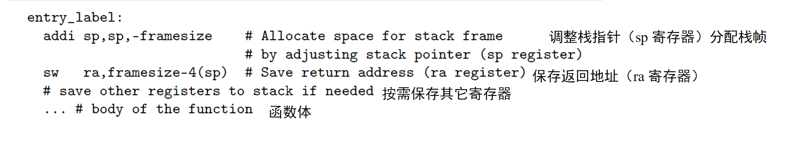
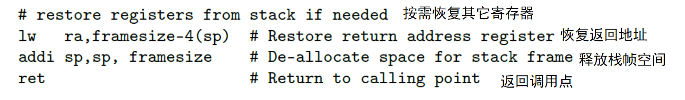
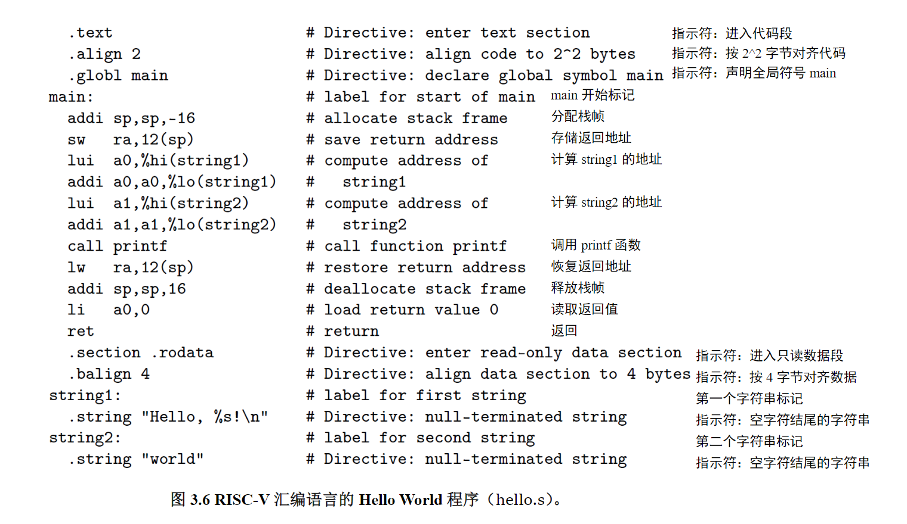
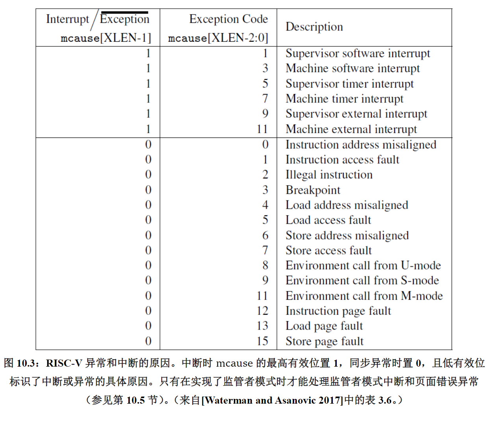
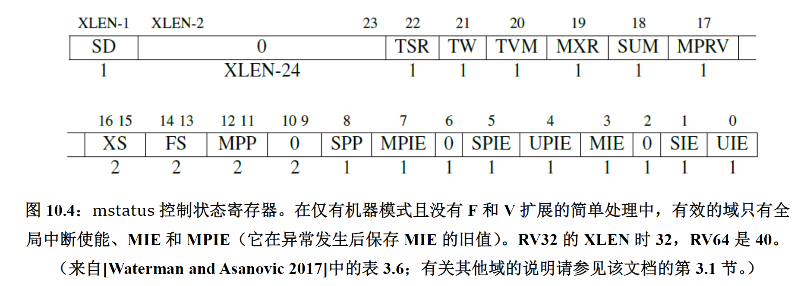
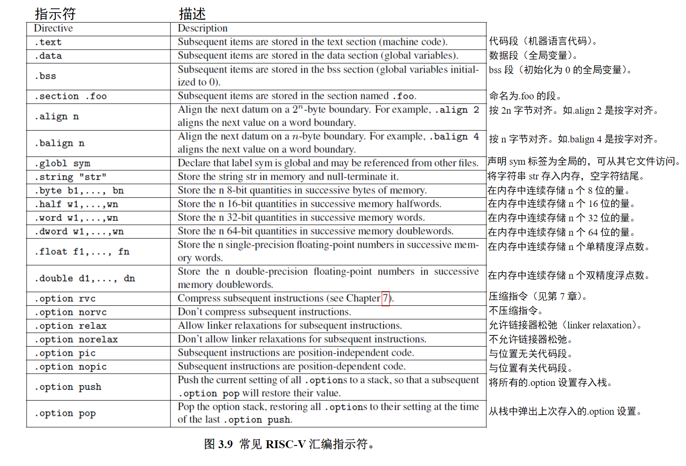

# 《The RISC-V Reader》 reading record  

## 第一章 为什么要有 RISC-V  

###  1.1 导言  

RISC-V（“ RISC five”）的目标是成为一个通用的指令集架构（ISA），要注意是指令集架构，这意味着这不仅是指令集，还应该自带体系  

###  1.2 模块化与增量型 ISA  

假设一家餐馆只提供固定价格的餐点，最初只是一顿包含汉堡和奶昔的小餐。随着时间的推移，它会加入薯条，然后是冰淇淋圣代，然后是沙拉，馅饼，葡萄酒，素食意大利面，牛排，啤酒，无穷无尽，直到它成为一顿大餐。食客可以在那家餐厅找到他们过去吃过的东西，尽管总的来说这样做可能没什么意义。这样做的坏处是，用餐者为每次晚餐支付的宴会费用不断增加。  

计算机体系结构的传统方法是在现有的指令集架构上进行小的修改或扩展（增量ISA），这个传统意味着x86-32（我们用它表示32位地址版本的x86）的每个实现必须实现过去的扩展中的错误设计，即便它们不再有意义。  

RISC-V的不同寻常之处，除了在于它是最近诞生的和开源的以外，还在于——和几乎所有以往的ISA不同——它是模块化的。  

它的核心是一个名为RV32I的基础ISA，运行一个完整的软件栈。RV32I是固定的，永远不会改变。这为编译器编写者，操作系统开发人员和汇编语言程序员提供了稳定的目标。  

模块化来源于可选的标准扩展，根据应用程序的需要，硬件可以包含或不包含这些扩展。这种模块化特性使得RISC-V具有了袖珍化、低能耗的特点，而这对于嵌入式应用可能至关重要。RISC-V编译器得知当前硬件包含哪些扩展后，便可以生成当前硬件条件下的最佳代码。惯例是把代表扩展的字母附加到指令集名称之后作为指示。例如，RV32IMFD将乘法（RV32M），单精度浮点（RV32F）和双精度浮点（RV32D）的扩展添加到了基础指令集（RV32I）中。  

RISC-V提供的是菜单，而不是一顿应有尽有的自助餐。即使那些新选择出现在了菜单上，它们仍是可选的，不会像在增量ISA中那样成为未来所有实现的必要组成部分。  

### 1.3 ISA 设计  101  

在介绍 RISC-V 这个 ISA 之前，了解计算机架构师在设计 ISA 时的基本原则和必须做出的权衡是有用的。如下的列表列出了七种衡量标准：  

- 成本（美元硬币）  
ISA 的精简化可以通过简化硬件设计、简化流水线、减少片上存储、降低功耗和提高性能等方式，缩小实现 ISA 的处理器的尺寸。  

- 简洁性（轮子）   

- 性能（速度计）   

- 架构和具体实现的分离（分开的两个半圆）   

- 提升空间（手风琴）  
随着摩尔定律（Moore’s law）的终结，对性价比进行重大改进的唯一途径是为特定领域（例如深度学习，增强现实，组合优化，图形等）添加自定义指令。这意味着如今的 ISA 必须保留操作码空间以供未来的提升  

- 程序大小（相对的压迫着一条线的两个箭头）   
程序越小，存储它所需的芯片面积就越小。更小的程序还能减少指令缓存的未命中问题，从而节省了功耗

- 易于编程/编译/链接（儿童积木“像 ABC 一样简单”）  

### 1.4 全书的总览

### 1.5 结束语

## 第二章 RV32I：RISC-V 基础整数指令集  

### 2.1 导言  

### 2.2 RV32I 指令格式  

RISC-V 指令只有六种格式，并且所有的指令都是 32 位长，这简化了指令解码

在 RISC-V 中对于所有指令，要读写的寄存器的标识符总是在同一位置，意味着在解码指令之前，就可以先开始访问寄存器。

为了给 ISA 扩展留出足够的空间，最基础的 RV32I 指令集只使用了 32 位指令字中的编码空间的不到八分之一

### 2.3 RV32I 寄存器  

RV32I 有 31 寄存器加上一个值恒为 0 的 x0 寄存器。与之相比，ARM-32 只有 16 个寄存器，x86-32 甚至只有 8 个寄存器  

### 2.4 RV32I 整数计算  

### 2.5 RV32I 的 Load 和 Store  

> RISC-V 选择了小尾端字节序，因为它在商业上占主导地位：所有 x86-32 系统，Apple iOS，
> 谷歌 Android 操作系统和微软 Windows for ARM 都是低字节优先序。由于字节顺序仅在同
> 时以按字访问和按字节访问同一份数据时才会有影响，字节序只会影响很少一部分的程序员。

### 2.6 RV32I 条件分支  

## 第三章  RISC-V 汇编语言  

### 3.2  函数调用规范（Calling convention）  

函数调用过程通常分为 6 个阶段[Patterson and Hennessy 2017]。 
1.  将参数存储到函数能够访问到的位置； 
2.  跳转到函数开始位置（使用 RV32I 的 jal指令）； 
3.  获取函数需要的局部存储资源，按需保存寄存器； 
4.  执行函数中的指令； 
5.  将返回值存储到调用者能够访问到的位置，恢复寄存器，释放局部存储资源； 
6.  返回调用函数的位置（使用 ret指令）。

为了获得良好的性能，变量应该尽量存放在寄存器而不是内存中，但同时也要注意避免频繁地保存和恢复寄存器，因为它们同样会访问内存。

函数调用中其它的寄存器，要么被当做**保存寄存器**来使用，在函数调用前后值不变；  
要么被当做**临时寄存器**使用，在函数调用中不保留。  
函数会更改用来保存返回值的寄存器，因此它们和临时寄存器类似；  
用来给函数传递参数的寄存器也不需要保留，因此它们也类似于临时寄存器。

根据 ABI 规范，我们来看看标准的 RV32I 函数入口和出口。下面是函数的开头：  

  

如果参数和局部变量太多，在寄存器中存不下，函数的开头会在栈中为函数帧分配空间，来存放。当一个函数的功能完成后，它的结尾部分释放栈帧并返回调用点：

  

### 3.3  汇编器  

在 Unix 系统中，这一步的输入是以.s 为后缀的文件  

经典的 C 程序 Hello World，编译器产生的汇编指令如图 3.6:  

  

汇编程序的开头是一些汇编指示符（assemble directives）。它们是汇编器的命令，具有告诉汇编器代码和数据的位置、指定程序中使用的特定代码和数据常量等作用。 

上图用到的指示符有： 
- .text：进入代码段。  
- .align 2：后续代码按 2^2 字节对齐。  
- .globl main：声明全局符号“main”。  
- .section .rodata：进入只读数据段  
- .balign 4：数据段按 4 字节对齐。  
- .string “Hello, %s!\n”：创建空字符结尾的字符串。  
- .string “world”：创建空字符结尾的字符串。  

汇编器产生如图 3.7 的目标文件，格式为标准的可执行可链接文件（ELF）格式  

.png)  

### 3.4  链接器  

链接器允许各个文件独立地进行编译和汇编，这样在改动部分文件时，不需要重新编译全部源代码。链接器把新的目标代码和已经存在的机器语言模块（如函数库）等“拼接”起来。链接器这个名字源于它的功能之一，即编辑所有对象文件的跳转并链接指令（jump and link）中的链接部分。它其实是链接编辑器（link editor）的简称。在 Unix 系统中，链接器的输入文件有.o后缀，输出 a.out文件；在 MS-DOS 中输入文件后缀为.OBJ 或.LIB，输出.EXE文件。  

### 3.5  静态链接和动态链接  

现在的许多系统使用动态链接（dynamic linking），外部的函数在第一次被调用时才会加载和链接。后续所有调用都使用快速链接（fast linking），因此只会产生一次动态开销。每次程序开始运行，它都会按照需要链接最新版本的库函数。另外，如果多个程序使用了同一个动态链接库，库代码在内存中只会加载一次。  

编译器产生的代码和静态链接的代码很相似。其不同之处在于，跳转的目标不是实际的函数，而是一个只有三条指令的存根函数（stub function）。存根函数会从内存中的一个表中加载实际的函数的地址并跳转。不过，在第一次调用时，表中还没有实际的函数的地址，只有一个动态链接的过程的地址。当这个动态链接过程被调用时，动态链接器通过符号表找到实际要调用的函数，复制到内存中，更新记录实际的函数地址的表。后续的每次调用的开销就是存根函数的三条指令的开销。

### 3.6  加载器

加载器的作用是把这个程序加载到内存中，并跳转到它开始的地址。  

动态链接程序的加载稍微有些复杂。操作系统不直接运行程序，而是运行一个动态链接器，再由动态链接器开始运行程序，并负责处理所有外部函数的第一次调用，把它们加载到内存中，并且修改程序，填入正确的调用地址。

### 3.7  结束语  

汇编器向 RISC-V ISA 中增加了 60 条伪指令，使得 RISC-V 代码更易于读写，并且不增加硬件开销。将一个寄存器硬编码为 0 使得其中许多伪指令更容易实现。使用加载高位立即数（lui）和程序计数器与高位立即数相加（auipc）两条指令，简化了编译器和链接器寻找外部数据/函数的地址的过程。使用相对地址转移的代码与位置无关，减少了链接器的工作。大量的寄存器减少了寄存器保存和恢复的次数，加速函数调用和返回。 RISC-V 提供了一系列简单又有影响力的机制，降低成本，提高性能，并且使得编写程序更加容易。 
 
体系结构研究者常用静态链接的基准程序来测试处理器，尽管大多数实际的程序都有动态链接。他们说，关心性能的用户应该只使用静态链接，但其实这并不合理，因为加速实际的程序显然比加速基准程序更有意义。 
 
## 第四章  乘法和除法指令  

### 4.1  导言  

## 第十章  RV32/64 特权架构  

### 10.1  导言  

到目前为止，本书主要关注 RISC-V 对通用计算的支持：我们引入的所有指令都在用户模式（应用程序的代码在此模式下运行）下可用。本章介绍两种新的权限模式：运行最可信的代码的机器模式（machine mode），以及为 Linux，FreeBSD 和 Windows 等操作系统提供支持的监管者模式（supervisor mode）。  

这两种新模式都比用和模式有着更高的权限，这也是本章标题的来源。有更多权限的模式通常可以使用权限较低的模式的所用功能，并且它们还有一些低权限模式下不可用的额外功能，例如处理中断和执行 I/O 的功能。处理器通常大部分时间都运行在权限最低的模式下，处理中断和异常时会将控制权移交到更高权限的模式。

嵌入式系统运行时（runtime）和操作系统用这些新模式的功能来响应外部事件，如网络数据包的到达；支持多任务处理和任务间保护；抽象和虚拟化硬件功能等。这一章节旨在强调 RISC-V 这部分功能的亮点。

本章将 RV32 和 RV64 特权架构一并介绍。一些概念仅在整数寄存器的大小上有所不同，因此为了描述简洁，我们引入术语 XLEN 来指代整数寄存器的宽度（以位为单位）。对于 RV32，XLEN 为 32；对 RV64，XLEN 则是 64。  

### 10.2  简单嵌入式系统的机器模式  

机器模式（缩写为 M 模式，M-mode）是 RISC-V 中 hart（hardware thread，硬件线程）可以执行的最高权限模式。  

在 M 模式下运行的 hart 对内存，I/O 和一些对于启动和配置系统来说必要的底层功能有着完全的使用权。因此它是唯一所有标准 RISC-V 处理器都必须实现的权限模式。实际上简单的 RISC-V 微控制器仅支持 M 模式。这类系统是本节的重点。

机器模式最重要的特性是拦截和处理异常（不寻常的运行时事件）的能力。RISC-V 将异常分为两类。一类是同步异常，这类异常在指令执行期间产生，如访问了无效的存储器地址或执行了具有无效操作码的指令时。另一类是中断，它是与指令流异步的外部事件，比如鼠标的单击。  

RISC-V 中实现精确例外：保证异常之前的所有指令都完整地执行了，而后续的指令都没有开始执行（或等同于没有执行）。图 10.3 列出了触发标准例外的原因。

  

在 M 模式运行期间可能发生的同步例外有五种：  
- 访问错误异常 当物理内存的地址不支持访问类型时发生（例如尝试写入 ROM）。   
- 断点异常 在执行 ebreak指令，或者地址或数据与调试触发器匹配时发生。  
- 环境调用异常 在执行 ecall指令时发生。  
- 非法指令异常 在译码阶段发现无效操作码时发生。  
- 非对齐地址异常 在有效地址不能被访问大小整除时发生，例如地址为 0x12 的 amoadd.w

### 10.3  机器模式下的异常处理  

八个控制状态寄存器（CSR）是机器模式下异常处理的必要部分：  
- mtvec（Machine Trap Vector）它保存发生异常时处理器需要跳转到的地址。  
- mepc（Machine Exception PC）它指向发生异常的指令。  
- mcause（Machine Exception Cause）它指示发生异常的种类。  
- mie（Machine Interrupt Enable）它指出处理器目前能处理和必须忽略的中断。  
- mip（Machine Interrupt Pending）它列出目前正准备处理的中断。  
- mtval（Machine Trap Value）它保存了陷入（trap）的附加信息：地址例外中出错的地址、发生非法指令例外的指令本身，对于其他异常，它的值为 0。  
- mscratch（Machine Scratch）它暂时存放一个字大小的数据。  
- mstatus（Machine Status）它保存全局中断使能，以及许多其他的状态，如图10.4 所示。

  

  

